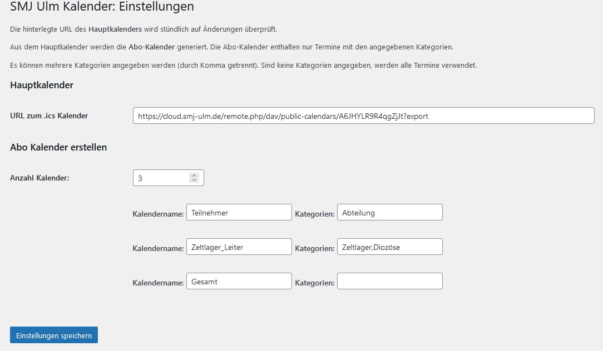

# SMJ Ulm Calendar Plugin

This plugin provides an interactive and customizable calendar synchronization system for WordPress. It's tailored for administrators who want to manage calendar categories and display settings effectively.


## Installation

1. Upload the plugin files to the `/wp-content/plugins/smj-ulm-calendar` directory
2. Activate the plugin through the ‘Plugins’ screen in WordPress.
3. Navigate to **Settings > SMJ Ulm Kalender** to customize the calendar options.


## Settings

The URL of the main calendar is checked hourly for updates.

The subscription calendars are generated from the main calendar and include only events with the specified categories.

Multiple categories can be specified (separated by commas). If no categories are specified, all events will be included.




## Usage

### All Events

#### Insert List:
```
[smj-ulm-cal_fulllist]
```

#### Insert List with Start and End Date:
The date must be in the format `YYYY-MM-DD`!
```
[smj-ulm-cal_fulllist startDate="2024-01-01" endDate="2024-12-31"]
```

#### Insert List and Filter by Category:
Categories must be separated by ','.
```
[smj-ulm-cal_fulllist categories="Zeltlager,Abteilung"]
```

#### Insert List and Hide Past Events:
```
[smj-ulm-cal_fulllist hidePastEvents="yes"]
```

#### Combine All Options:
```
[smj-ulm-cal_fulllist hidePastEvents="yes" categories="Zeltlager" startDate="2024-01-01" endDate="2024-12-31"]
```

### Upcoming Events:

#### Insert List:
`num_max_events`: maximum number of events to display. `num_max_events` must be a number `>0`!  
`num_months`: maximum number of months to display. `num_months` must be a number `>0`!
```
[smj-ulm-cal_nextevents num_max_events=5 num_months=3]
```

#### Insert List and Filter by Category:
Categories must be separated by ','.
```
[smj-ulm-cal_nextevents num_max_events=5 num_months=3 categories="Zeltlager,Abteilung"]
```

## Statistics

On the statistics page, the generated subscription calendar URLs are displayed.

All events contained in the calendar are shown. Events are sorted by categories.
## Contribution

Feel free to submit issues or contribute to the development. Fork the repository and create a pull request for review.

## License

This project is licensed under the MIT License.